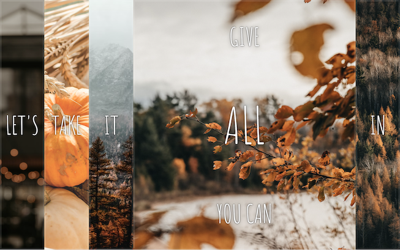

# Flex Panel Image Gallery

## Description

This is the fifth exercise in the Wes Bos JavaScript 30 challenge. The challenge was CSS heavy but required event listeners to toggle certain properties.

- My motivation was to continue to build my skillset
- This exercise inspired me to play with flex and transitions more.
- The most interesting part of this exercise was the concept of flex-grow and how it specifies how an element should grow to fit the space.

## Usage

There are five images arranged in columns with one word visible in each. When you click in one of these columns, the image and text get larger and more words appear from the top and bottom. Each section with grow and shrink in this fashion.

[Live Gallery Page](katemcro.github.io/flexGalleryJS30_05/)

## Credits

This project is from Wes Bos' free [#JavaScript30](https://javascript30.com/) coding challenge.
